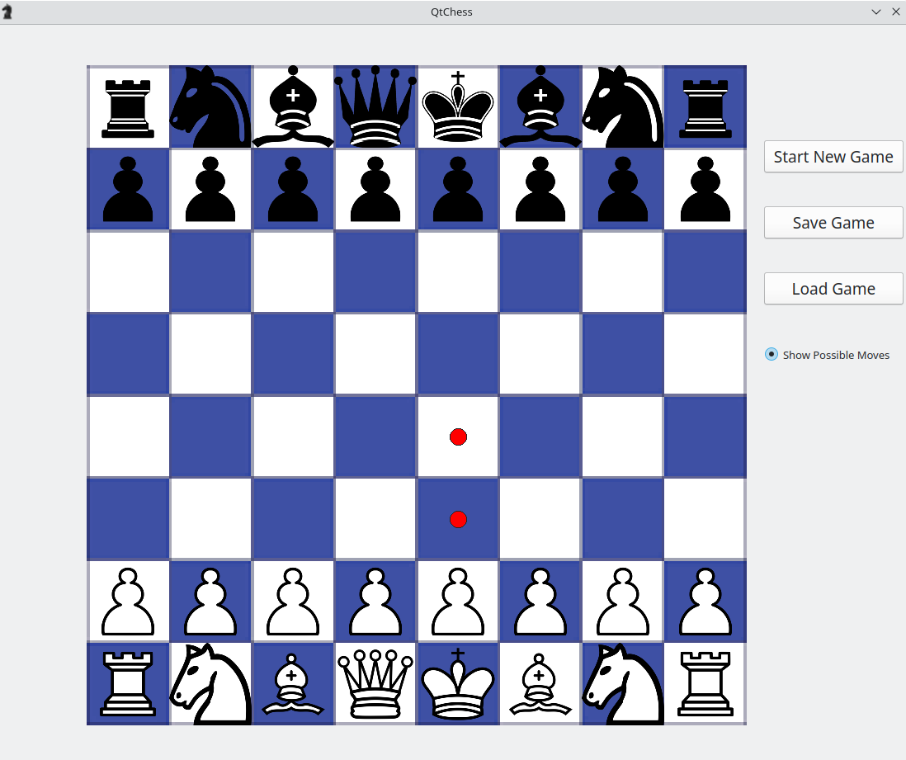

Chess game with a graphical interface. The game is two-player and does not include an AI opponent. When the "Start New Game" button is pressed, the game starts according to the rules of chess, with the classic starting position.

The game consists of consecutive moves by the white and black pieces. Each piece in the game moves according to its own specific rules. If a piece moves to a square occupied by an opponent's piece, it captures it. There is no possibility to capture your own piece. The implementation of the game requires checking the correctness of moves entered on the graphical interface and checking for end-game conditions.
The game ends if one player creates a checkmate situation, which occurs when they would have the ability to capture the opponent's king in the next move, or if a stalemate position occurs on the board.
The game ends in a draw under any of the following conditions:
* Neither player has the necessary quantity and quality of pieces for checkmate.
* One player has no legal moves, but their king is not under attack.
* 50 moves have passed since the last capture or pawn move.
* The same position occurs on the board for the third time.
